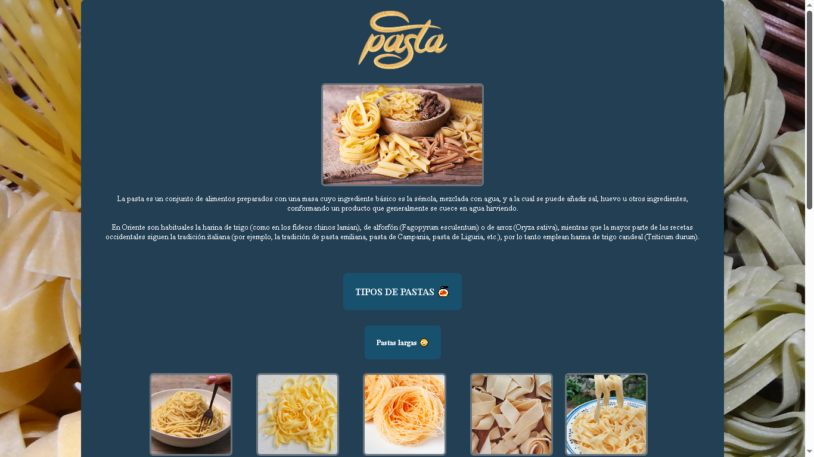
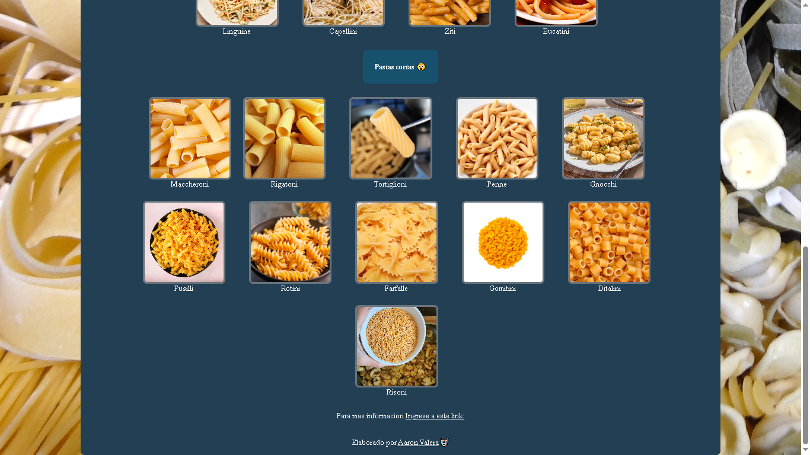
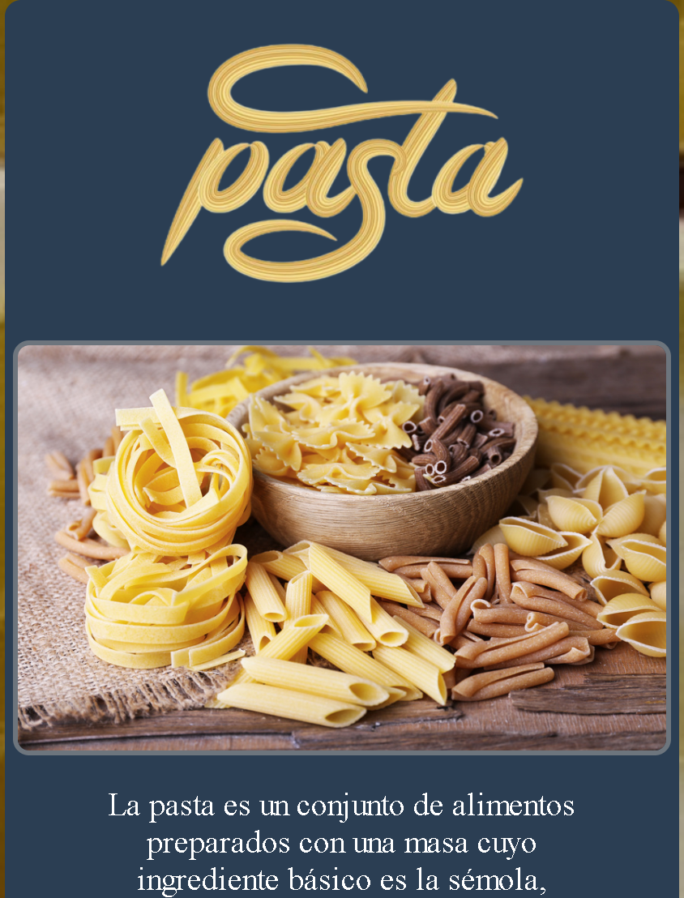
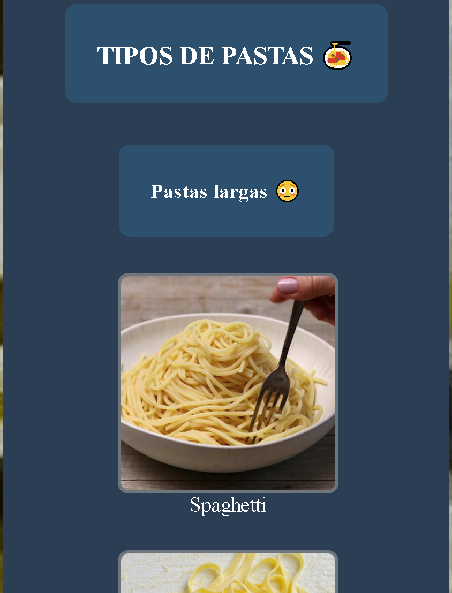

## INDEX
* [1. Pasta Blog](#1-pasta-blog-)
* [2. Screenshots](#2-screenshots)
* [3. License](#3-license)
* [4. Author](#4-author)

# 1. Pasta Blog 🍝

A digital resource designed to explore the fascinating universe of pasta. This blog features a detailed library of pasta varieties, ranging from world-famous classics to niche regional shapes, including pairing suggestions and cultural origins.

### Key Features:

* Responsive Design: Optimized for quick consultation on mobile devices while cooking.

## 2. Screenshots

### PC
***

    
    

### Smartphones
***

    
    

## 3. License

[MIT](https://choosealicense.com/licenses/mit/)

## 4. Author

[Aaron Valera](https://github.com/aaronvalera/)